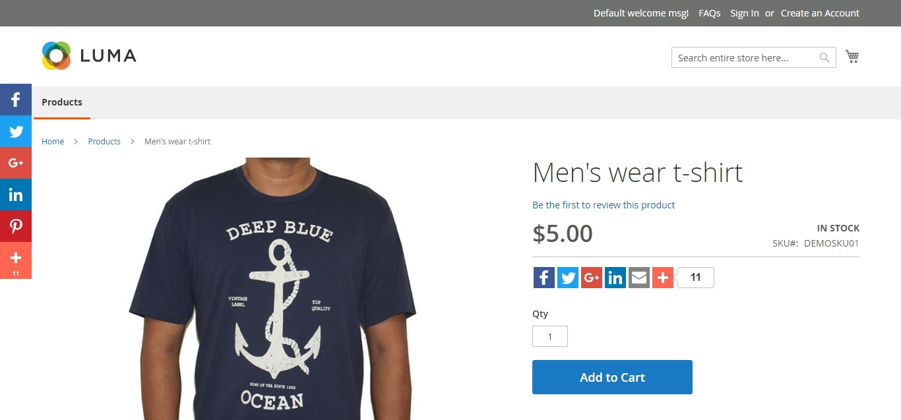
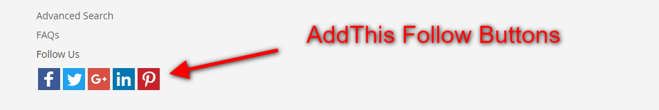
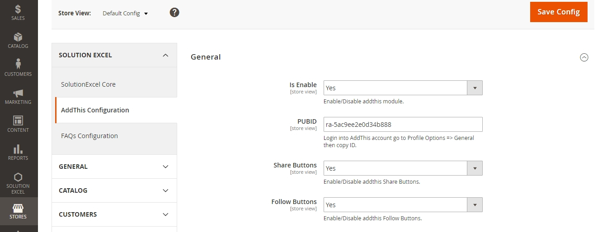

# Magento2 AddThis
Magento2 AddThis extension for share and follow buttons. Buttons render from AddThis account using PUBID. You can get PUBID form addThis account. Login into addThis account using our login credential and go to Profile Options => General In General section you can see you like ID: ra-5ac9ee2e0d34b888

## Compatible With:
Magento ver 2.2.3

## Available Features:
* Enable/Disable extension from admin system configuration.
* Floating SHARE buttons.
* Inline FOLLOW buttons.
* Enable/Disable share buttons from product details page.
* Enable/Disable follow buttons from footer. 
* Settings PUBID is very important for this extension.
* Login into addThis account using our login credential and go to Profile Options => General In General section you can see you like ID: ra-5ac9ee2e0d34b888

## Frontend view

## Backend Settings

## Installation
##### Manually (not recommended)
 * Download AddThis Extension
 * Unzip the magento2-addthis-master.zip file
 * Create a folder {Magento 2 root}/app/code/Solutionexcel/AddThis
 * Copy/Upload all files and folder to AddThis folder

#### Step 2 - Enable/Install via command line
 * php bin/magento module:enable --clear-static-content Solutionexcel_AddThis
 * php bin/magento setup:upgrade
 * php bin/magento cache:flush

If you have any inquiry please contact with me via email or skype.
* Email: [info@solutionexcel.com](mailto:info@solutionexcel.com)
* Skype: solutionexcel
* Web: [Solution Excel](https://www.solutionexcel.com/)
